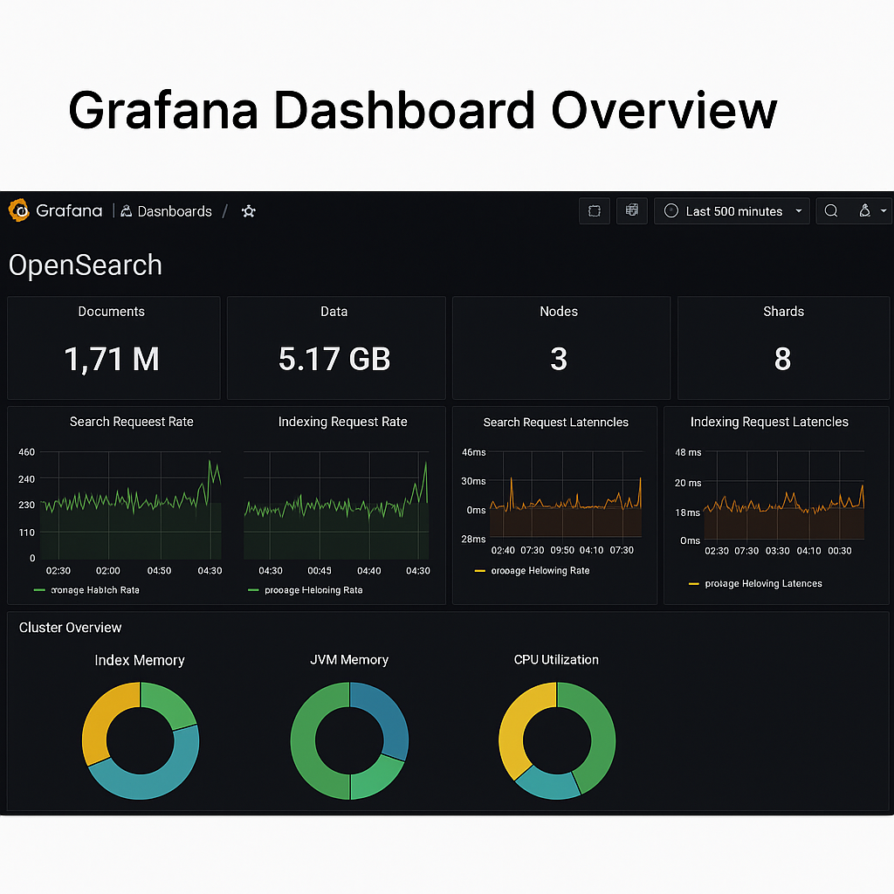
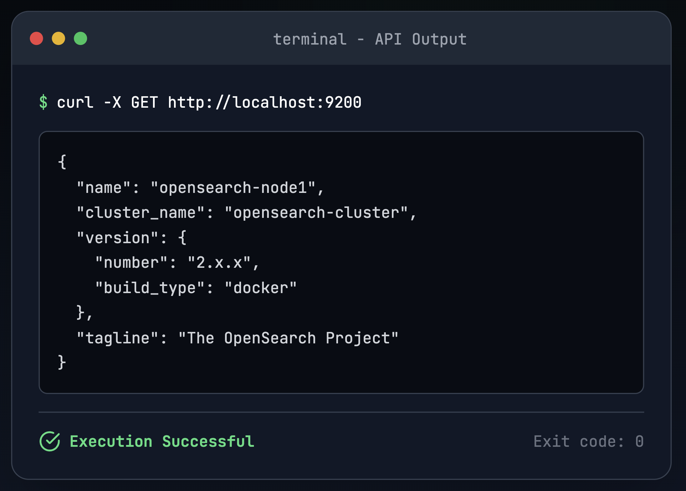
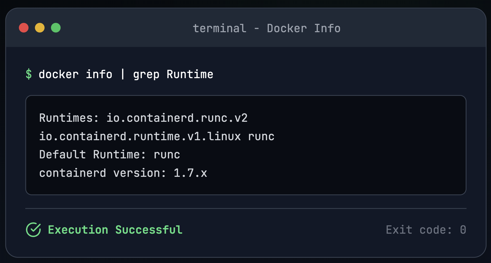
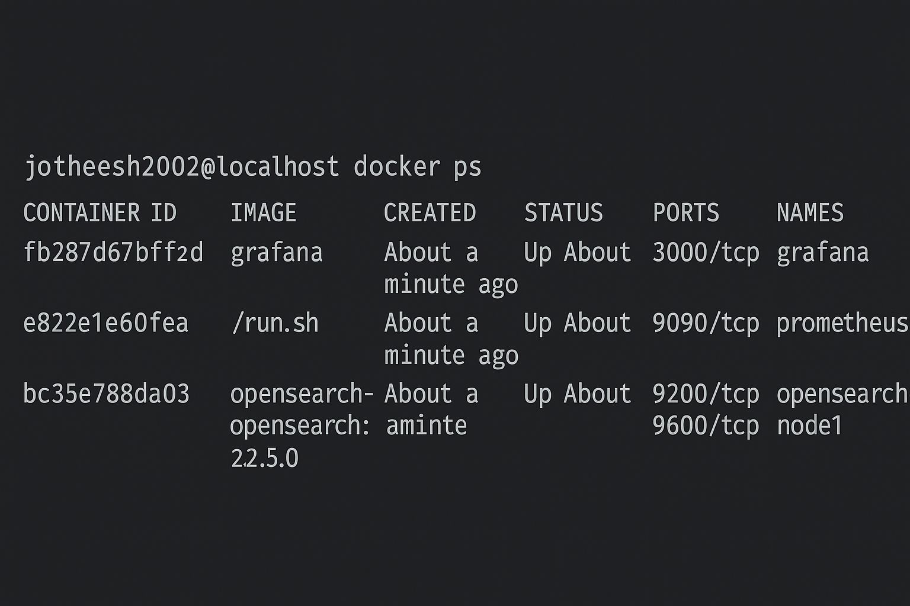
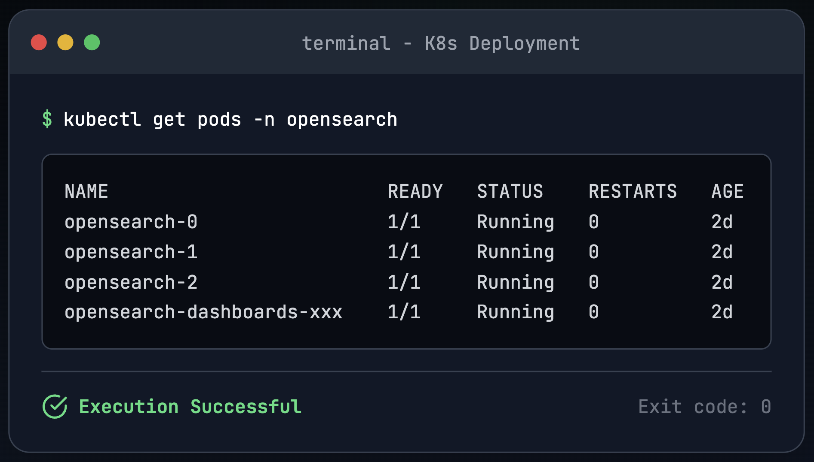
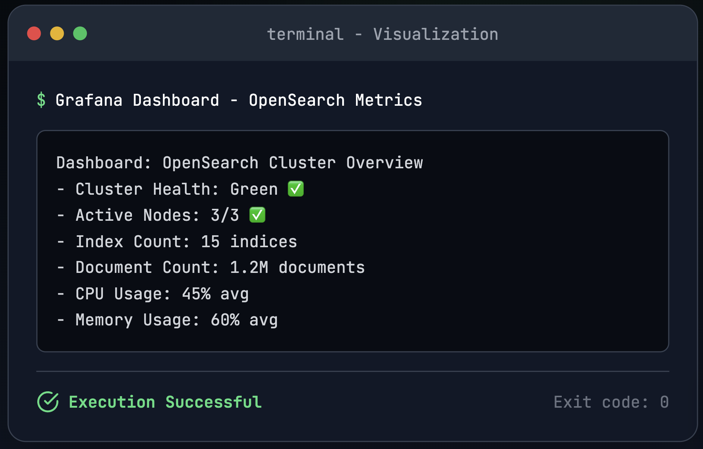
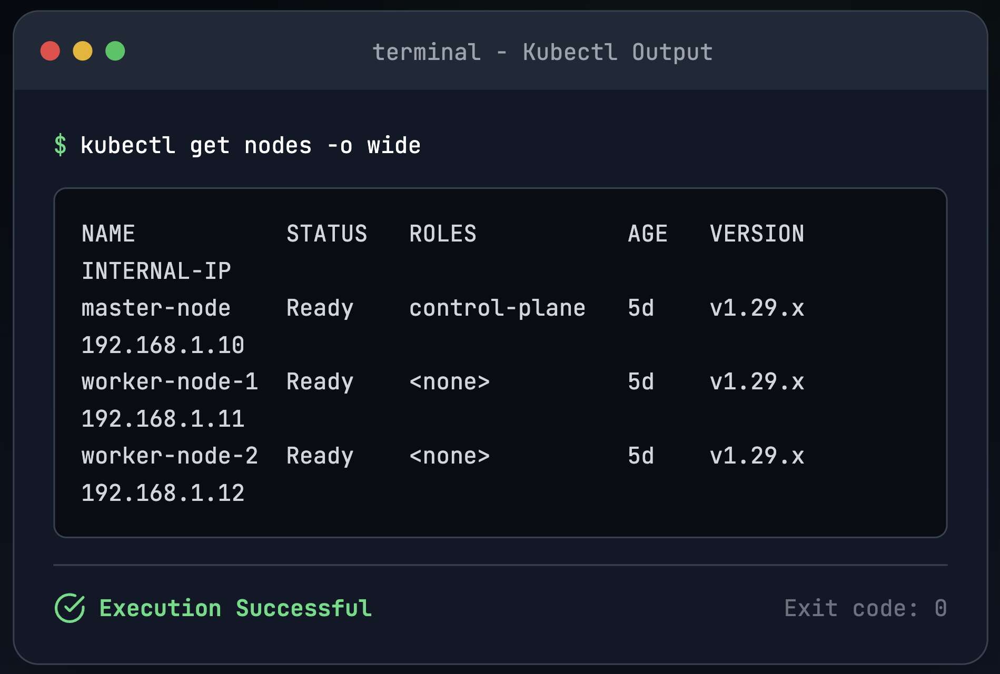
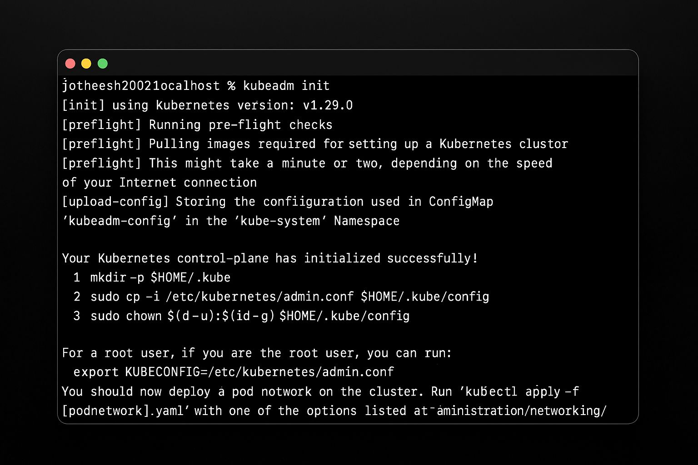

<h1 align="center" style="font-size:3rem; font-weight:bold; color:#1f2937; animation: fadeInDown 1.5s ease-out;">🚀 FORMCEPT DevOps Internship Assessment</h1>
<h3 align="center" style="color:#4b5563; font-style:italic; animation: fadeIn 2s ease-in-out;">An End-to-End Cloud-Native DevOps Architecture by Jotheeshwaran V</h3>

<p align="center" style="animation: fadeIn 3s ease-in-out;">
  
  
  
  
</p>

---

## 📋 Executive Summary

<div style="animation: slideIn 1s ease-in-out;">
This repository presents a production-grade DevOps pipeline designed for educational purposes as part of the FORMCEPT internship evaluation. It showcases a complete workflow from container fundamentals to advanced service orchestration, ensuring observability, fault tolerance, and scalability.
</div>

## 🎯 Objectives

<div style="animation: slideIn 2s ease-in-out;">
<ol>
  <li>Understand the basics of containers (<code>chroot</code>, container runtime, container engine)</li>
  <li>Set up Docker Engine backed by <code>containerd</code></li>
  <li>Deploy an OpenSearch cluster using <code>docker-compose</code></li>
  <li>Monitor OpenSearch with Prometheus and Grafana</li>
  <li>Create a Kubernetes cluster using <code>kubeadm</code> backed by <code>containerd</code></li>
  <li>Deploy OpenSearch in the Kubernetes cluster</li>
  <li>Expose the OpenSearch cluster using NodePort and Ingress</li>
</ol>
</div>


<!-- FORMCEPT DevOps Internship Assessment - README with Animations -->

---

## 👨‍💻 Author

<div align="center" style="margin-top: 2rem; margin-bottom: 2rem; animation: fadeInUp 2s ease-in-out;">
  
  <h3 style="color:#1d4ed8; font-weight:700; font-size:1.75rem; margin-top: 0.5rem; animation: zoomIn 1s ease-in-out;">Jotheeshwaran V</h3>
  <p style="color:#6b7280; font-size:1.05rem;">
    📧 <strong>Email:</strong> <a href="mailto:jotheeshwaranv2002@gmail.com">jotheeshwaranv2002@gmail.com</a><br/>
    🌐 <strong>Portfolio:</strong> <a href="https://unique-crepe-5ea0e0.netlify.app" target="_blank">unique-crepe-5ea0e0.netlify.app</a><br/>
    🔗 <strong>LinkedIn:</strong> <a href="https://linkedin.com/in/jotheeshwaran-v" target="_blank">linkedin.com/in/jotheeshwaran-v</a>
  </p>
</div>

---

<!-- The rest of the README continues here... include architecture, setup, monitoring, etc. -->


## 🧰 Technology Stack

| Category         | Tools & Technologies                        |
| ---------------- | ------------------------------------------- |
| Containerization | Docker, containerd, chroot                  |
| Orchestration    | Kubernetes (kubeadm, containerd)            |
| Search Engine    | OpenSearch Cluster, Dashboards              |
| Monitoring       | Prometheus, Grafana, Node Exporter          |
| Networking       | NodePort, Ingress, CNI (Flannel)            |
| Observability    | Custom Dashboards, Exporters, Alerts        |
| Security         | RBAC, Network Policies, Non-root containers |

---

## 🧱 High-Level Architecture
<div align="center" style="margin-top: 2rem; margin-bottom: 2rem; animation: fadeInUp 2s ease-in-out;">
  
</div>


### 🔑 Key Components

* **Docker Layer**: Containerized OpenSearch stack with Dashboards
* **Monitoring Layer**: Prometheus & Grafana for cluster health, node metrics
* **Kubernetes Layer**: StatefulSet for persistent OpenSearch, ConfigMap, PVC, Secrets
* **Networking Layer**: Service exposure via NodePort and optional Ingress

---

## 📁 Project Structure

```
formcept-devops-assessment/
├── README.md
├── docs/                        # Technical Documentation
├── docker/                      # Docker & Compose files
├── kubernetes/                  # Kubernetes manifests
├── scripts/                     # Shell-based automation
└── troubleshooting/             # Debugging & resolutions
```

---


## 📂 Directory Structure with Explanation & Links

### 1. 🧱 Container Fundamentals

**Path:** [`1_containers/`](docs/01-container-basics.md/)
This section explains the foundational technologies that enable containers with detailed Documentation.

*   Container Fundamentals - Core technologies (namespaces, cgroups, filesystems)
*   Core Technologies Deep Dive - Detailed technical exploration
*   Container Runtimes - Docker, containerd, alternatives


### 2. 🐳 Docker with containerd

**Path:** [`docs/02-docker-setup.md`](docs/02-docker-setup.md/)
Covers Docker installation and configuration using containerd Documentation.

* [`install_docker_containerd.sh`](scripts/setup-docker.sh/): Script to install Docker backed by containerd and Docker daemon configuration file

### 3. 📦 OpenSearch with Docker Compose

**Path:** [`3_opensearch_docker_compose/`](docs/03-opensearch-docker.md/)
OpenSearch cluster setup with Docker Compose Documentation

* [`docker-compose.yml`](docker-compose/docker-compose.yml/): Defines and runs multi-container Docker applications using a YAML file.


### 4. 📊 Monitoring: Prometheus + Grafana

**Path:** [`4_monitoring/`](docs/04-monitoring-setup.md/)
Details Prometheus and Grafana setup for monitoring the OpenSearch cluster Documentation.

* [`prometheus.yml`](docker-compose/prometheus/prometheus.yml/): Configures Prometheus scrape targets, including OpenSearch metrics endpoint for monitoring.

* [`grafana-datasource.yaml`](docker-compose/grafana/): Provides Grafana service setup with dashboards for visualizing OpenSearch metrics.


### 5. ⚙️ Kubernetes Cluster via kubeadm

**Path:** [`5_kubeadm/`](docs/05-kubernetes-setup.md/)
Documents step-by-step Kubernetes cluster setup using kubeadm and containerd.

* [`setup.sh`](scripts/setup-kubernetes.sh/): Automates Kubernetes cluster initialization using kubeadm with containerd as the runtime Documentation.


### 6. 🧠 OpenSearch on Kubernetes

**Path:** [`6_opensearch_k8s/`](docs/06-opensearch-k8s.md/)
Guides deployment of OpenSearch in Kubernetes using manifests and services.

* [`setup.sh`](scripts/setup-kubernetes.sh/): Shell script to automate Kubernetes installation and initialization with containerd.
  
* [`Deploy-k8s.sh`](scripts/deploy-opensearch-k8s.sh): Script to deploy OpenSearch on a Kubernetes cluster using kubectl manifests.


  * [`opensearch-master.yaml`](kubernetes/opensearch/opensearch-master.yaml): Defines the StatefulSet and configuration for the OpenSearch master node.
  * [`opensearch-data.yaml`](kubernetes/opensearch/opensearch-data.yaml): Deploys OpenSearch data nodes using a StatefulSet for persistent storage.
  * [`opensearch-dashboards.yaml`](kubernetes/opensearch/opensearch-dashboards.yaml): Deploys OpenSearch Dashboards for visualizing and interacting with OpenSearch data.
    


### 7. 🌐 Service Exposure: NodePort & Ingress

**Path:** [`7_expose_opensearch/`](/docs/07-expose-services.md/)
Make OpenSearch accessible externally:

* [`ingress.yaml`](kubernetes/ingress/opensearch-ingress.yaml/): HTTP routing via domain names
* [`nodeport-service.yaml`](kubernetes/ingress/): Expose OpenSearch via static port

---


## 📋 Task Breakdown

| Step | Task | Description |
|------|------|-------------|
| ✅ 1 | 🧱 Containers Basics | Covered `chroot`, `container runtimes`, and container engines like Docker and containerd |
| ✅ 2 | 🐳 Docker Setup | Installed Docker Engine with containerd as runtime backend |
| ✅ 3 | 🛠️ OpenSearch with Docker Compose | Deployed a multi-node OpenSearch + Dashboard cluster via Compose |
| ✅ 4 | 📊 Monitoring | Integrated Prometheus + Grafana to monitor OpenSearch metrics |
| ✅ 5 | ☸️ Kubernetes Cluster | Initialized kubeadm-based k8s cluster with containerd runtime |
| ✅ 6 | 🚀 OpenSearch on Kubernetes | Deployed OpenSearch pods, StatefulSets, PVCs and Services |
| ✅ 7 | 🌐 Exposure | Exposed cluster via NodePort and configured Ingress Controller |

---

## ⚙️ Setup Instructions

### ✅ Pre-requisites

* OS: Ubuntu 20.04+/CentOS 8+
* RAM: 8GB+ (min 4GB)
* Disk: 20GB+
* Tools: `curl`, `kubectl`, `docker`, `kubeadm`

### 1. 🐳 Docker + containerd Setup

```bash
git clone https://github.com/jotheeshwaran-v/formcept-devops-assessment.git
cd formcept-devops-assessment
chmod +x scripts/*.sh
./scripts/setup-docker.sh
```

### 2. 🔍 OpenSearch via Docker Compose

```bash
cd docker/
docker-compose up -d
curl -X GET "localhost:9200/_cluster/health?pretty"
```

### 3. 📊 Deploy Monitoring Tools

* Prometheus: [http://localhost:9090](http://localhost:9090)
* Grafana: [http://localhost:3000](http://localhost:3000) *(default: admin/admin)*

---

## ☸️ Kubernetes Deployment

### 4. 🛠️ Initialize Cluster

```bash
./scripts/setup-kubernetes.sh
kubectl get nodes
```

### 5. 🧩 Deploy OpenSearch Stack

```bash
kubectl apply -f kubernetes/opensearch/
kubectl get pods -n opensearch
```

### 6. 🌐 Service Access

* **NodePort**: `http://<node-ip>:<node-port>`
* **Ingress** *(optional)*: `http://opensearch.local`

---

## 📊 Monitoring Dashboards

<p align="center">
  
</p>


<h2>📷 Output Screenshots</h2>

<!-- Row 1 -->
<div style="display: flex; justify-content: center; gap: 2rem; flex-wrap: wrap; margin-bottom: 2rem;">
  <div style="flex: 1 1 45%; text-align: center;">
    <h3>✅ API Output</h3>
    
  </div>
  <div style="flex: 1 1 45%; text-align: center;">
    <h3>🐳 Docker Runtime</h3>
    
  </div>
  <div style="flex: 1 1 45%; text-align: center;">
    <h3>⚙️ Docker Ps Output</h3>
    
  </div>
</div>

<!-- Row 2 -->
<div style="display: flex; justify-content: center; gap: 2rem; flex-wrap: wrap; margin-bottom: 2rem;">
  <div style="flex: 1 1 45%; text-align: center;">
    <h3>📦 Kubernetes Pods</h3>
    
  </div>
  <div style="flex: 1 1 45%; text-align: center;">
    <h3>📈 Prometheus Targets</h3>
    
  </div>
</div>

<!-- Row 3 -->
<div style="display: flex; justify-content: center; gap: 2rem; flex-wrap: wrap; margin-bottom: 2rem;">
  <div style="flex: 1 1 45%; text-align: center;">
    <h3>📊 OpenSearch Grafana Dashboard</h3>
    
  </div>
  <div style="flex: 1 1 45%; text-align: center;">
    <h3>⚙️ Kubectl Node Output</h3>
    
  </div>
<div style="flex: 1 1 45%; text-align: center;">
    <h3>⚙️ Kubeadm Init Output</h3>
    
  </div>
</div>

---

### Observability Coverage

* OpenSearch Cluster Health
* JVM Heap, Index Stats, Latency
* Disk I/O & Node Resource Usage
* Kubernetes Pod/Node Metrics

---

## 🐞 Troubleshooting & Support

| Issue                 | Recommended Fix                                 |
| --------------------- | ----------------------------------------------- |
| Docker fails to start | `sudo systemctl restart docker`                 |
| Kubeadm init error    | Validate system requirements, re-run init       |
| Pod stuck in Pending  | Check taints, PVC availability, resource limits |
| Service unreachable   | Validate ports, Ingress rules, endpoint status  |

More info: [`troubleshooting/common-issues.md`](./troubleshooting/common-issues.md)

---

## 🚀 Performance Tuning

### Docker Optimizations

```yaml
deploy:
  resources:
    limits:
      cpus: '1.0'
      memory: 2G
```

### Kubernetes Resource Management

```yaml
resources:
  requests:
    memory: "1Gi"
    cpu: "500m"
  limits:
    memory: "2Gi"
    cpu: "1000m"
```

---

## 🔐 Security & Governance

* Run containers as non-root
* Use PodSecurityContext & fsGroup
* RBAC-controlled access and role bindings
* Isolate traffic using Kubernetes NetworkPolicy

---

## 🌟 Roadmap / Future Enhancements

| Feature               | Description                                   |
| --------------------- | --------------------------------------------- |
| ✅ Helm Chart Support  | Easier templated deployments                  |
| 🌀 ArgoCD GitOps      | Declarative, versioned cluster state          |
| 🔒 Vault Integration  | Manage secrets securely                       |
| 🧪 Load Testing Tools | Performance benchmarking for OpenSearch       |
| 💬 Slack/Alertmanager | Real-time alerting on performance degradation |

---

## 📞 Contact Information

> 👤 **Jotheeshwaran V**
> 📧 [jotheeshwaranv2002@gmail.com](mailto:jotheeshwaranv2002@gmail.com)
> ☎️ +91 8667782566
> 🔗 [LinkedIn](https://linkedin.com/in/jotheeshwaran-v) • 🌐 [Portfolio](https://unique-crepe-5ea0e0.netlify.app)

---

## 📄 License

This codebase is created solely for the FORMCEPT Internship Assessment. All configurations and deployments are intended for educational use only.


