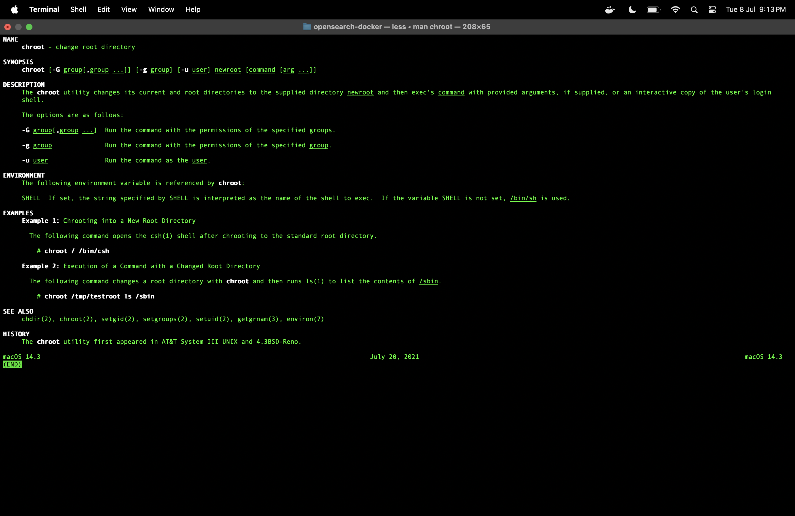
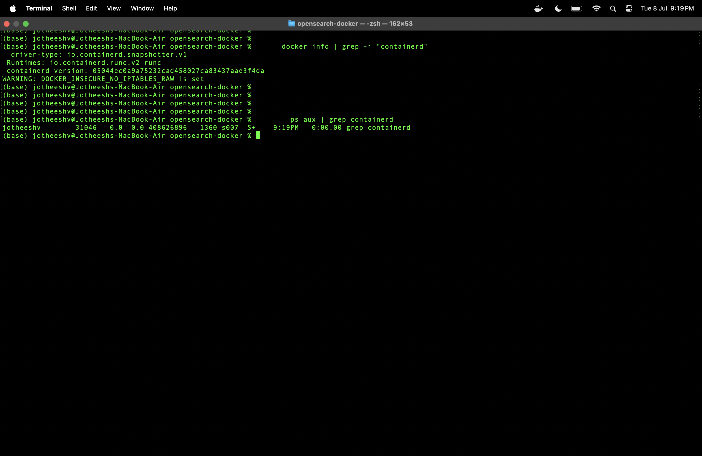
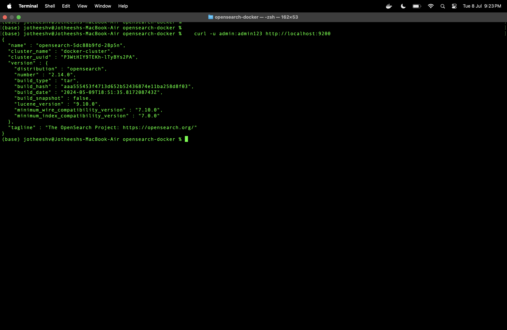
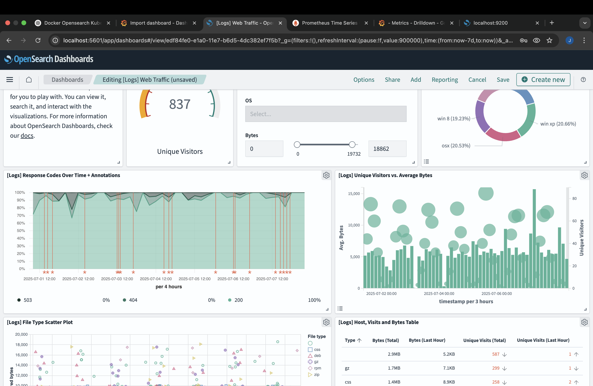
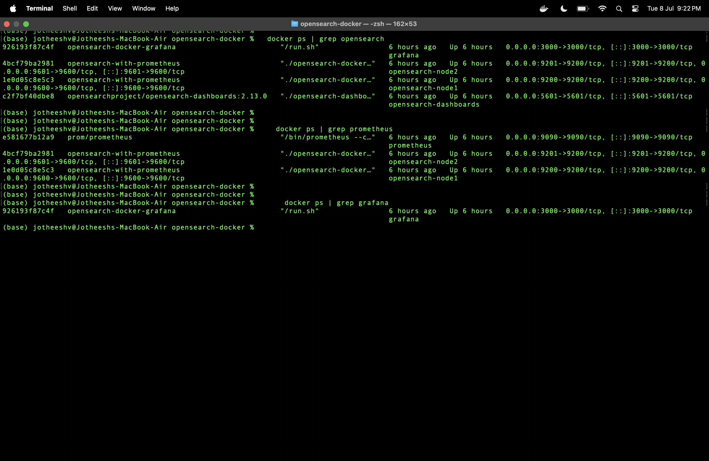
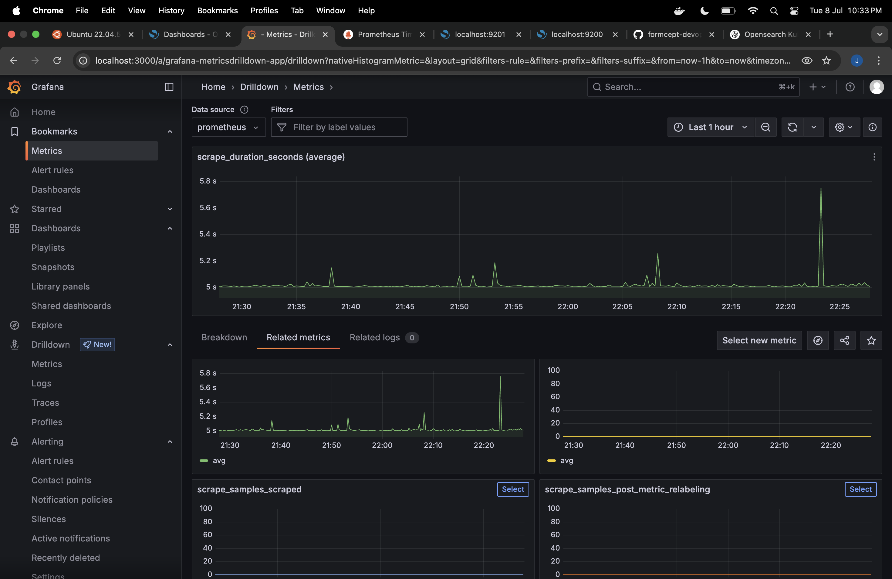
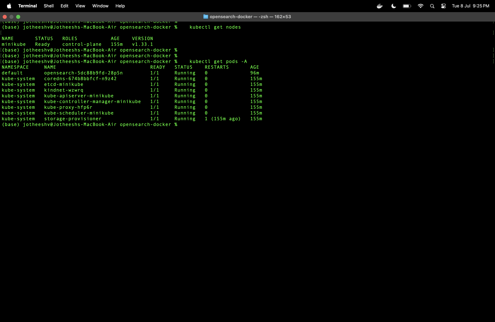
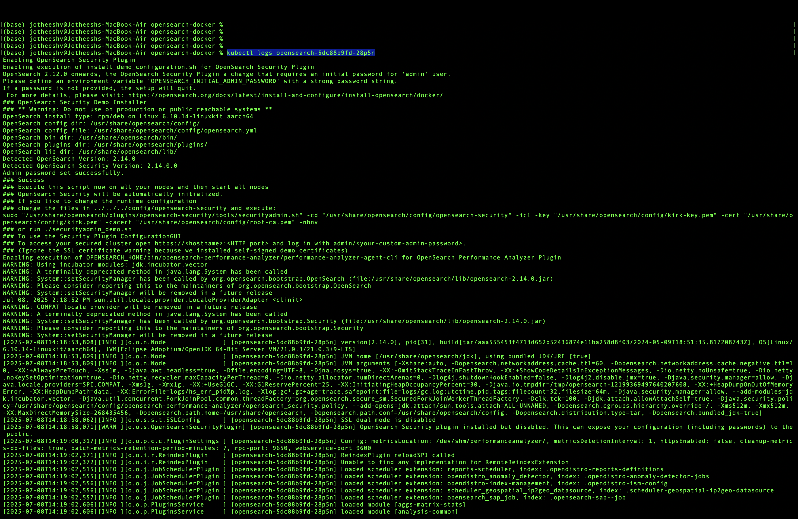
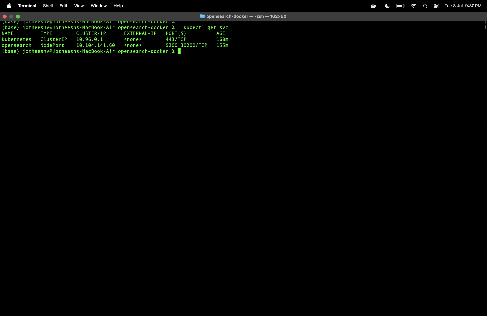

## 🚀 OpenSearch Deployment: From Docker to Kubernetes
This guide demonstrates how to understand and deploy OpenSearch using Docker and Kubernetes backed by containerd, and how to monitor it using Prometheus and Grafana.

## 📦 1. Understanding Containers
### 🔒 chroot: Basic Isolation
```bash

man chroot
```
chroot changes the root directory for a process, providing basic filesystem-level isolation — the foundational idea behind containers.




####   Container Engine (Docker)

```bash

docker version
```
Docker is a container engine that interfaces with containerd to provide CLI and API tools to manage containers.


## 🛠 2. Setup Docker Engine with containerd
### ✅ Check Docker Engine using containerd

```bash

docker info | grep -i "containerd"
```
####  ✅ Verify containerd is running

```bash

  ps aux | grep containerd
```


## 📦 3. Deploy OpenSearch Cluster with Docker Compose
### docker-compose.yml Example

```bash

cat docker-compose.yml
```
#### ⬆️ Launch OpenSearch

```bash

docker-compose up -d

docker ps | grep opensearch
```
#### 🔍 Test OpenSearch API



```bash

curl -u admin:admin123 http://localhost:9200
```



## 📊 4. Monitor with Prometheus + Grafana
### ✔️ Confirm Services Running

```bash

docker ps | grep prometheus
docker ps | grep grafana
```


### 📍 Prometheus Targets & Grafana Dashboards
Access via browser (update with your local ports):

```
Prometheus: http://localhost:9090/targets
```
```
Grafana: http://localhost:3000
```



## ☸️ 5. Create Kubernetes Cluster (Kubeadm + containerd)
### 🚀 Check Cluster & Pods
```bash

kubectl get nodes
kubectl get pods -A
```


## 🔁 6. Deploy OpenSearch to Kubernetes
#### 📄 View Deployment YAML
```bash

cat opensearch-deployment.yml
```
#### ⬆️ Apply Deployment
```bash

kubectl apply -f opensearch-deployment.yml
kubectl get pods -w
```
#### 🧾 Logs
```bash

kubectl logs <opensearch-pod-name>
```


## 🌐 7. Expose OpenSearch (NodePort / Ingress)
#### 📄 View Service Manifest
```bash

cat opensearch-service.yml
```
#### 🔎 View Services
```bash

kubectl get svc
```


#### 📡 Test Access (NodePort)
```bash

curl -u admin:admin123 http://$(minikube ip):<nodeport>
```
#### 🌍 Or via Ingress
```bash

curl -u admin:admin123 http://<ingress-host>
```
🎥 Tips for Sharing Terminal Sessions
Use tmux or screen for clean session sharing.


#### environment proof:

```bash
Copy code
uname -m            # Should say arm64 on M2
minikube status
docker info
kubectl config current-context
```


